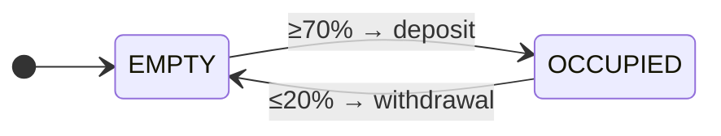
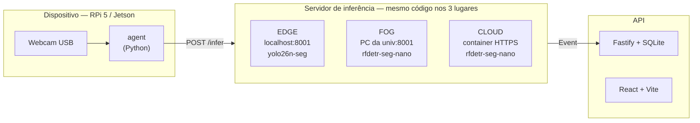
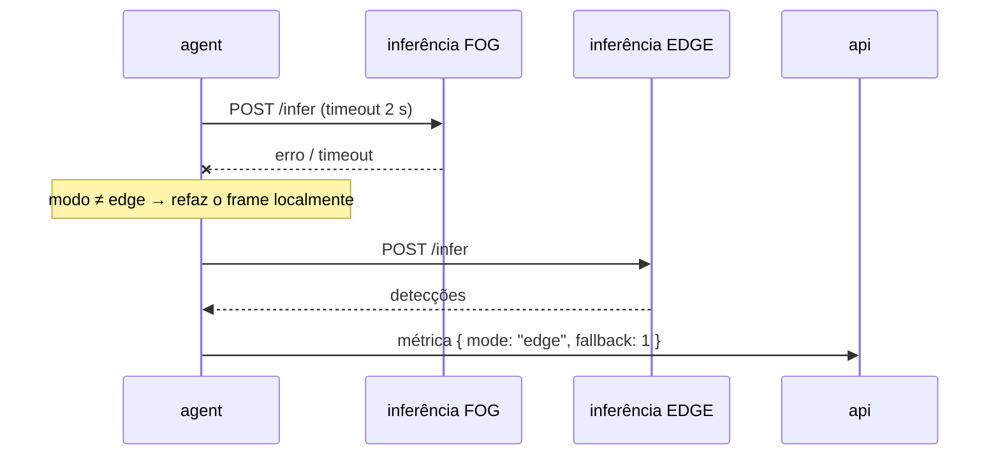
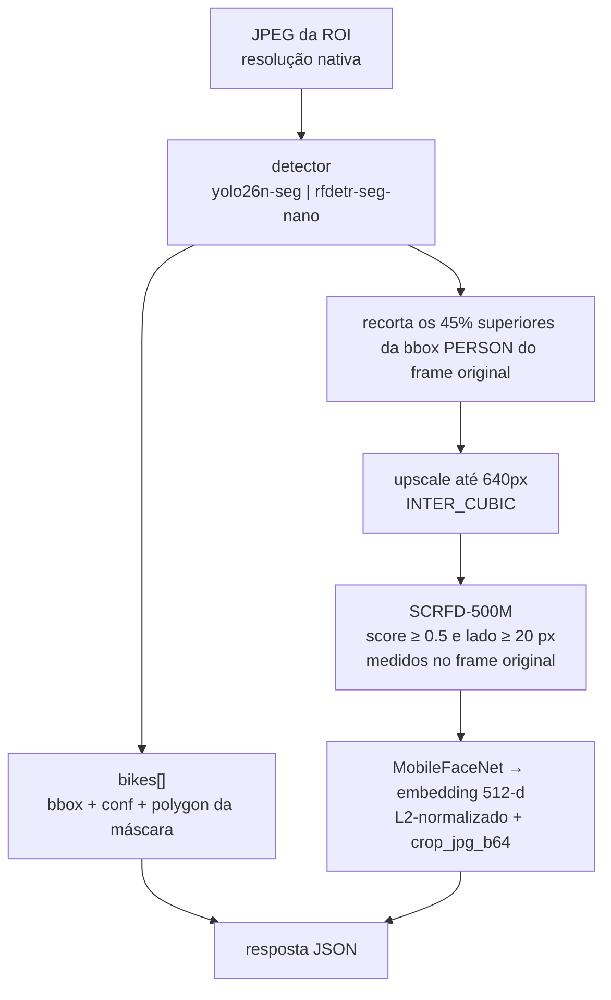
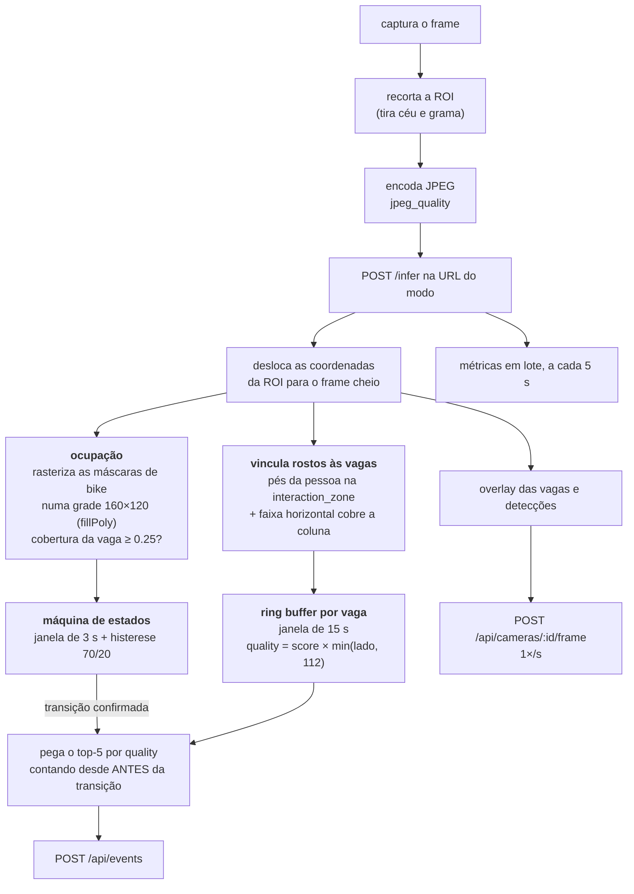
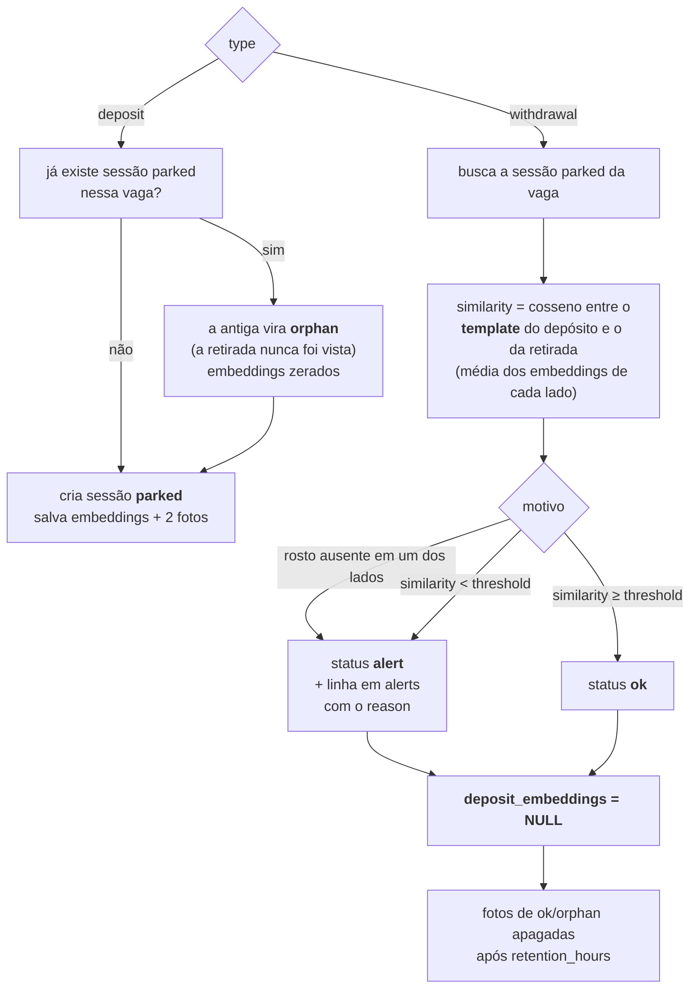

# BikeGuard

Sistema de visão computacional que vigia um bicicletário universitário com uma câmera USB
e avisa a portaria quando **quem retira a bicicleta não é quem a deixou**.

Não é identificação facial (não há banco de rostos): é **verificação 1:1**. Quando uma vaga
passa de vazia para ocupada, o sistema guarda o embedding do rosto de quem estacionou.
Quando a vaga esvazia, compara com o rosto de quem retirou. Similaridade baixa → um **pedido
de verificação** na tela da portaria, com as duas fotos lado a lado e um humano decidindo.

MVP de hackathon: código direto, sem ORM, sem autenticação, sem filas.
As regras de projeto e os números medidos em campo estão em [`CLAUDE.md`](CLAUDE.md).

---

## Índice

- [Como funciona](#como-funciona)
- [Pipeline de comunicação](#pipeline-de-comunicação)
- [Pipeline de processamento](#pipeline-de-processamento)
- [Estrutura dos arquivos](#estrutura-dos-arquivos)
- [Como rodar](#como-rodar)
- [Limpar o banco de dados](#limpar-o-banco-de-dados)
- [Flags e variáveis de ambiente](#flags-e-variáveis-de-ambiente)
- [Privacidade (LGPD)](#privacidade-lgpd)
- [Estado atual](#estado-atual)

---

## Como funciona

A câmera fica no gramado, **de frente** para o rack, a 1.2–1.6 m de altura e 3–4 m de distância.
Nesse ângulo cada vaga é uma **faixa vertical** entre duas barras do rack, e quem estaciona fica
atrás da bike empurrando-a *em direção à câmera* — ou seja, olha para a lente nos dois momentos
que importam (chegada e retirada). Os polígonos das vagas ficam em `vision/config/slots.json`,
normalizados em [0..1].




Os percentuais são a fração dos frames da janela de 3 s em que alguma bicicleta cobriu ≥25% da vaga.


A histerese (70% para ocupar, 20% para liberar) existe porque para cada estado a métrica mais importante muda, falsos-positivos são ruins para o estado *EMPTY*; já para o estado *OCCUPIED*, falsos-negativos.

---

## Pipeline de comunicação

Três processos, um contrato HTTP cada. A api e a web ficam num lugar fixo (laptop da equipe);
o "modo de processamento" se refere **apenas** à inferência.



### Fallback



Caso o *FOG/CLOUD* não respondam, a inferência usa um fallback, continuando o processamento em *EDGE*.

---

## Pipeline de processamento

### Dentro do servidor de inferência (Stateless)



### Dentro do agente



### Dentro da api, quando chega um evento



---

## Estrutura dos arquivos

```
.
├── CLAUDE.md                     # especificação, números medidos em campo, decisões tomadas
├── README.md
│
├── vision/                       # Python 3.12 (venv em vision/.venv)
│   ├── requirements.txt
│   ├── run_inference.sh          # sobe o uvicorn já sem o PYTHONPATH do ROS
│   ├── Dockerfile.inference      # imagem do modo CLOUD (pesos embutidos)
│   ├── models/                   # pesos baixados (gitignored)
│   ├── samples/                  # fotos/vídeos reais do bicicletário (VERSIONADO)
│   │
│   ├── common/
│   │   ├── schemas.py            # dataclasses do contrato /infer + Face.quality
│   │   └── geometry.py           # cobertura por fillPoly, IoU, crop_roi, denormalização
│   │
│   ├── inference/                # ── o que muda de lugar ──
│   │   ├── server.py             # FastAPI: POST /infer, GET /health. Stateless.
│   │   ├── detector.py           # YoloDetector | RFDetrDetector, build_detector() com cache
│   │   └── faces.py              # crop 45% → upscale 640 → SCRFD → MobileFaceNet
│   │
│   ├── agent/                    # ── o que roda sempre no dispositivo ──
│   │   ├── main.py               # o loop; fallback edge; CLI
│   │   ├── occupancy.py          # máscaras de bike ∩ polígono da vaga
│   │   ├── slots_state.py        # janela deslizante + histerese, emite Transition
│   │   ├── face_buffer.py        # ring buffer por vaga + link_faces_to_slots
│   │   ├── api_client.py         # config/eventos/métricas/frame + InferenceClient
│   │   └── draw.py               # overlay
│   │
│   ├── config/slots.json         # polígonos das vagas + interaction_zone, [0..1]
│   └── scripts/
│       ├── download_models.sh    # yolo26n-seg.pt + buffalo_s
│       ├── annotate_slots.py     # clica os polígonos e gera o slots.json real
│       └── calibrate.py          # genuínos × impostores, histograma + limiar sugerido
│
├── api/                          # Node + TypeScript strict, Fastify + better-sqlite3
│   ├── src/
│   │   ├── index.ts              # servidor, purga de retenção no boot e a cada hora
│   │   ├── db.ts                 # schema em CREATE TABLE IF NOT EXISTS, WAL
│   │   ├── similarity.ts         # cosine + maxPairwise
│   │   ├── config.ts             # config default + merge
│   │   ├── images.ts             # base64 → api/data/faces/<uuid>.jpg
│   │   └── routes/
│   │       ├── events.ts         # a regra de negócio: deposit / withdrawal / purga
│   │       ├── sessions.ts       # sessões + GET /api/slots (estado por vaga)
│   │       ├── alerts.ts         # abertos + /ack
│   │       ├── config.ts         # GET / PUT
│   │       ├── metrics.ts        # insert em lote + resumo por modo
│   │       └── cameras.ts        # último frame em memória + em disco
│   └── data/                     # bikeguard.db, faces/, frames/ (gitignored)
│
└── web/                          # Vite + React 19 + Tailwind 4 + recharts
    ├── vite.config.ts            # proxy /api e /files → :3000
    └── src/
        ├── api.ts                # tipos compartilhados + hook usePolling
        └── pages/
            ├── Dashboard.tsx     # frame ao vivo + grade de vagas + modo e FPS
            ├── Portaria.tsx      # alertas: as duas fotos, similaridade, "Verificado"
            ├── Eventos.tsx       # tabela de sessões, filtrável por status
            ├── Configuracoes.tsx # seletor Edge/Fog/Cloud, URLs, limiares
            └── Metricas.tsx      # latência por modo no tempo + médias e % fallback
```

Nota sobre a fronteira: **tudo em `inference/` é stateless e intercambiável de lugar; tudo em
`agent/` guarda estado e nunca sai do dispositivo.** Se um arquivo de `inference/` precisar
lembrar de algo entre frames, a arquitetura quebrou.

---

## Como rodar

### Instalação (uma vez)

```bash
# visão
cd vision
python3 -m venv .venv
.venv/bin/pip install -r requirements.txt
bash scripts/download_models.sh        # yolo26n-seg.pt + buffalo_s (~15 MB)

# api e web
cd ../api && npm i
cd ../web && npm i
```

> **Atenção, usuários de ROS:** se o seu shell tem `/opt/ros/.../site-packages` no `PYTHONPATH`,
> ele entra **antes** da venv e sombreia o numpy/opencv dela. Todo comando Python deste README
> usa `env -u PYTHONPATH` ou o `run_inference.sh`, que já faz isso.

### Os quatro processos

Cada um num terminal:

```bash
# 1) inferência                                                    → :8001
cd vision && ./run_inference.sh

# 2) api                                                           → :3000
cd api && npm run dev

# 3) web                                                           → :5173
cd web && npm run dev

# 4) agente (webcam)
cd vision && env -u PYTHONPATH .venv/bin/python -m agent.main --source 0 --show
```

Abra <http://localhost:5173>. Sem o agente rodando o Dashboard mostra um aviso no lugar do frame.

Plano B da demo (e ambiente padrão de desenvolvimento) é o vídeo em loop — os vídeos reais do
bicicletário estão em `vision/samples/`:

```bash
cd vision && env -u PYTHONPATH .venv/bin/python -m agent.main --source samples/Insercao_P1.mp4
```

Num arquivo o agente descarta frames para manter o tempo do vídeo colado no tempo real (um clipe
de 14 s leva 14 s), porque o debounce conta segundos de relógio. Com `--no-loop` ele para no fim.

### Se a câmera for remontada

O `slots.json` versionado é a geometria **real** do rack dos vídeos em `samples/` (6 vãos entre os
7 montantes). Mexeu na câmera, refaça:

```bash
cd vision
env -u PYTHONPATH .venv/bin/python scripts/annotate_slots.py --source 0 --out config/slots.json
```

E recalibre o limiar sempre que houver mais gente filmada (uma subpasta por pessoa):

```bash
env -u PYTHONPATH .venv/bin/python scripts/calibrate.py --dir samples/pessoas --out calibracao.png
```

O `calibrate.py` mede os cossenos de pares da mesma pessoa (genuínos) e de pessoas diferentes
(impostores), sugere o limiar que minimiza os dois erros e gera o histograma —
`samples/calibracao.png` é o resultado com as duas pessoas filmadas até agora, e vai para a
apresentação.

---

## Flags e variáveis de ambiente

### `agent.main` — o agente

| Flag | Default | O que faz |
|---|---|---|
| `--source` | `0` | Fonte de vídeo. Um número é índice de webcam (`0` = primeira); qualquer outra coisa é caminho de arquivo, e o vídeo roda **em loop** (útil para demo e desenvolvimento). |
| `--api` | `http://localhost:3000` | URL da api. Passe `--api ''` para rodar **offline**: o agente cai para os defaults da config e só loga as transições no console. Bom para testar a visão sem subir o resto. |
| `--camera` | `cam1` | Identificador desta câmera. Aparece nas rotas (`/api/cameras/cam1/frame.jpg`) e nas tabelas. Mude se houver mais de uma câmera contra a mesma api. |
| `--slots` | `vision/config/slots.json` | Arquivo de polígonos das vagas. Aponte para outro se tiver mais de um bicicletário. |
| `--edge-url` | `http://localhost:8001` | Servidor de inferência **local**. Usado no modo edge e, sempre, como destino do fallback quando fog/cloud falha — por isso vale a pena mantê-lo de pé mesmo em modo cloud. |
| `--show` | desligado | Abre uma janela OpenCV com o overlay (vagas, detecções, estado). Não use em máquina sem display / via SSH sem X. `q` fecha. |
| `--no-loop` | desligado | Só afeta arquivo de vídeo: para no fim em vez de repetir. Use para rodar um cenário uma vez e ler o resultado; sem ele o vídeo repete e cada volta gera um ciclo depósito/retirada completo. |

Tudo o mais — modo, URLs, FPS alvo, ROI, limiares, `top_k`, `timeout_ms` — vem do
`GET /api/config` e é editável na página **Configurações**, sem reiniciar o agente.

---

## Privacidade (LGPD)

Biometria é dado pessoal sensível (LGPD art. 5º II / art. 11). O que o MVP faz:

- **Embeddings existem só enquanto a bike está estacionada.** Na retirada, depois da comparação,
  `deposit_embeddings` vira `NULL` na mesma transação.
- **Fotos de sessões normais são apagadas** após `retention_hours` (default 24) — purga no boot
  e a cada hora.
- **O alerta é um pedido de verificação, não uma acusação.** Humano no loop, sempre: a tela da
  portaria mostra as duas fotos e diz isso com essas palavras.
- **No modo edge nenhuma imagem de rosto sai do dispositivo** exceto nos eventos.
- Em produção faltariam sinalização no local, base legal e a política de retenção da universidade.

---